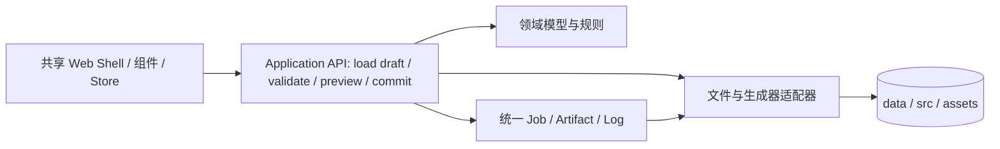
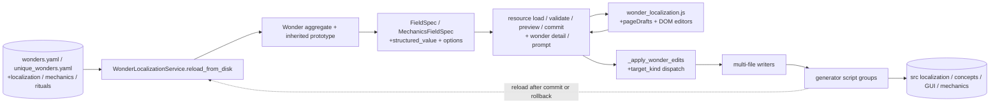

# Towards Victory Editor Web 现状评估与改造指导

## 结论

`towards_victory_editor_web` 已统一启动命令和浏览器入口，cost/reward、victory tree、Wonder 与 Wonder crop 配置均已接入统一资源协议。Wonder 同时完成了 bootstrap、仪式设计按需加载和共享选项目录的传输优化；媒体生成仍使用异步 job/artifact 生命周期，但现在已有首个资源依赖与产物契约切片，Wonder 的生成链现已抽出独立 DAG 执行器，并与媒体任务共享产物报告和格式校验；底层执行生命周期尚未完全统一。

因此，当前主要问题不是页面是否放在同一个标签栏，而是统一资源模型、保存事务、服务协议、前端状态模型和设计令牌尚未覆盖全部工具。若继续在现有壳层上添加标签页，功能数量会增加，架构一致性不会提高。

“完全一致”应定义为平台契约一致：所有工具使用同一套资源描述、校验、草稿、保存、生成、日志和错误协议；页面共享同一套布局、控件、状态和主题令牌。各领域仍可以保留不同的编辑器交互，例如树形画布与表单编辑不应被强行做成同一种控件。

## 现状基线

以下架构诊断记录迁移前的基线；具体切片进度以文末“当前验证结果”为准。

### 入口已经合并，服务没有合并

`server.py` 分别实例化 `CostRewardEditorService`、`VictoryTreePlannerService` 和 `WonderLocalizationService`，并接入 cropper、media registry 和 jobs（见 [server.py](../../towards_victory_editor_web/server.py)）。四个编辑器均提供 `/api/resources/{resource_id}` 及其 `validate/preview/commit` 操作；Wonder 的详情、仪式设计和 Prompt 仍有领域专用读取接口。媒体生成工具仍走 `/api/jobs` 协议。

媒体侧虽然有 `ToolSpec`、`ToolRegistry` 和 `JobManager`，但编辑器只是通过 `registry.register_spec(..., interactive=True)` 注册了展示元数据，并没有进入同一个 handler、校验、作业或结果协议（见 [media.py](../../towards_victory_editor_web/services/media.py#L14)）。这说明“统一工具目录”目前只覆盖媒体执行工具，未覆盖交互式编辑器。

### 后端仍是三个旧领域服务加一套新作业系统

当前服务规模和职责仍明显不对称：`wonder_localization.py` 约 3,800 行，四个编辑器仍各自维护领域加载、校验、内存状态和日志；Wonder 只是在外层增加了统一资源描述、快照、预览和提交事务。媒体则由 `tooling.py`、`media.py`、`media_tools.py`、`media_plans.py`、`cropper.py` 组成另一条生命周期。旧工具在提交 `1653d467` 中被移入统一包，但提交内容主要是入口、路由和静态资源迁移，原有 service 和页面逻辑基本被保留；提交 `d56fa727` 又在此基础上追加了媒体作业框架。这与“拼接旧工具”的现象相符。

编辑器保存是同步请求，通过各自的资源 commit 写入文件；媒体任务是异步、线程池、作业轮询和产物快照。`JobManager` 允许三个 worker，但用全局执行锁把实际写入串行化（见 [tooling.py](../../towards_victory_editor_web/services/tooling.py#L289)）。两个 Wonder 媒体作业锁定 `editor.wonder`、`editor.wonder_crop` 和 `editor.cost_reward`；会运行生成器的 Wonder commit 锁定 `editor.wonder` 与 `editor.cost_reward`，禁用生成时只锁前者；crop commit 锁定 `editor.wonder_crop`；修改 cost/reward 分类时的 commit 锁定 `editor.cost_reward` 与 `editor.wonder`，只改 task pool 时只锁 `editor.cost_reward`。victory tree 尚未共享，也没有统一的变更事件或提交记录。

### 数据契约没有共同的资源边界

不同工具直接绑定不同文件集合：

- cost/reward 直接维护 `data/cost_reward_units.yaml` 与 `data/task_pool.yaml`；
- victory tree 维护树变体、节点坐标，并在服务初始化时解码 DDS 预览（见 [victory_tree.py](../../towards_victory_editor_web/services/victory_tree.py#L111)）；
- wonder 编辑器同时读取本地化、通用奇观、机制、独特奇观、仪式设计、提示词、索引和生成脚本输入（见 [wonder_localization.py](../../towards_victory_editor_web/services/wonder_localization.py) 的 `_load_from_disk()`），保存时由 [generation.py](../../towards_victory_editor_web/services/generation.py) 的 `run_generation()` 执行生成计划；
- media 生成工具通过 job 写入 DDS/PNG 等产物；cropper 的 `data/wonder_image_crops.json` 已通过资源接口编辑，PNG 读取和 DDS 重建仍分别走图片读取与 job 接口。

cost/reward、victory tree、Wonder 和 cropper 配置现在通过统一 `ResourceDescriptor`、源文件 SHA-256 快照、draft、校验、预览 diff 和 commit 返回变更集合；媒体工具也开始在 `ToolSpec` 和 job payload 中声明资源依赖、源文件快照与允许的产物格式。当前仍没有完整的生成依赖图、跨资源 batch change set 或跨资源统一预览；Wonder 现有生成范围已有独立 DAG 和逐产物报告，但尚未按字段建立完整的输入依赖图。

### 保存流程存在跨文件一致性风险

cost/reward、tree、Wonder 和 cropper 的统一 commit 都先校验加载时 base，再构建候选内容并暂存写入；Wonder commit 还会快照源文件和登记的生成产物，生成器失败时恢复这些快照并重新加载服务。当前暂存替换对多个目标文件仍不是全局 POSIX 原子操作，跨资源提交也尚未组合成一个事务。

Wonder 的生成器由 [generation.py](../../towards_victory_editor_web/services/generation.py) 使用当前进程的 `sys.executable` 直接运行。领域目录 [wonder_generation.py](../../towards_victory_editor_web/services/wonder_generation.py) 声明脚本、依赖和 GUI 合并输入；预览 API 返回执行计划，保存 API 返回生成报告，目前页面尚未展示这两项数据。保存对每步及最终产物校验，失败进入现有文件恢复事务。

### 前端只有壳层共享，状态和组件没有共享

`index.html` 将五个工作区和六个独立模块全部加载到同一页面（见 [index.html](../../towards_victory_editor_web/static/index.html#L1)）。`shared.js` 只负责标签切换和 `body.dataset.activeTool`，没有路由、共享 store、请求层、通知、dirty 状态、权限或错误边界（见 [shared.js](../../towards_victory_editor_web/static/shared.js#L1)）。每个模块继续拥有自己的全局 `state`、`fetch` 封装、渲染函数和保存语义。

CSS 也只是叠加覆盖：`shared.css` 保留旧的深色根样式，`workspace_theme.css` 再覆盖为浅色主题；wonder 仍有一套约 1,331 行的专用视觉系统，cost/reward、tree、media/cropper 又各自保留布局和控件规则。两个 `:root`、多个 `body`、`button`、输入框规则并存，主题顺序成为行为的一部分，而不是显式设计系统（见 [shared.css](../../towards_victory_editor_web/static/shared.css#L1)、[workspace_theme.css](../../towards_victory_editor_web/static/workspace_theme.css#L1)）。

前端交互仍未完全统一：四个编辑器共享资源级 load/validate/preview/commit 入口，但各自保留领域 draft 和渲染状态；媒体生成提交 job、轮询、取消并接收产物报告。编辑资源与执行生成仍是两种工作模型。

## 主要缺陷

按影响排序，当前缺陷可以归纳为以下六类：

1. **架构边界缺失**：统一入口没有统一 application/service/domain 层；路由直接持有领域 service，媒体 registry 与编辑器 registry 是两套概念。
2. **资源模型不完整**：cost/reward、victory tree、Wonder 和 cropper 配置已有资源描述与源文件快照，但完整的“源数据—生成器—产物—校验”依赖图仍未覆盖媒体生成，也没有跨资源 change set。
3. **写入不可组合**：四个编辑器已有资源级 draft、预览 diff、base 冲突检测和提交入口，Wonder 也已有生成失败恢复；Wonder 已有生成 DAG 和文件级产物校验；跨资源 batch change set、完整输入依赖、领域语义校验和全局多文件原子替换仍未完成。
4. **运行时契约不一致**：同步接口、异步作业、直接文件服务和脚本子进程混用；错误码、日志、状态、返回 payload 也不一致。
5. **前端一致性不足**：共享的只有 tab shell 和少量 CSS 变量，组件、表单 schema、请求状态、dirty/save/reload 逻辑各自复制。
6. **验证覆盖不匹配**：现有 `--check`、资源契约、文件事务和媒体作业测试能证明部分 API、冲突检测、输入快照和产物格式校验，但还没有证明跨工具状态同步、并发编辑合并、响应式布局或视觉一致性。

## 改造主要阻力

### 1. wonder 编辑器是高耦合核心

wonder 服务不只是 CRUD，它还负责字段规格生成、来源追踪、结构化编辑器、多个 YAML 的读写、生成器编排、概念输出和仪式设计展示。它既是领域模型、编译器 facade，也是 UI schema provider。若直接把它拆成通用 CRUD，会损失现有语义；若继续保留 3,800 行单体，又会把旧边界带入新平台。

### 2. 生成器副作用没有被建模

现有 generator 既可能写 `src_*`，也可能写 localization、GUI、concept 和媒体产物。统一后端必须知道每个 generator 的输入、输出、可否预览、失败恢复和依赖顺序，否则只能继续在 service 中硬编码脚本列表。

### 3. 文件格式和注释保留要求真实存在

项目数据是 YAML、JSON、DDS、PNG 和游戏脚本的混合物，部分 YAML 还要求保留 BOM、头部注释和字段顺序。把所有内容强行转换成一个数据库或一个 JSON schema，短期会破坏生成器和审阅流程。因此需要“统一资源接口 + 格式适配器”，而不是先抹平文件格式。

### 4. 旧前端隐含了大量交互语义

奇观编辑器的结构化字段、原型继承、仪式设计和多页草稿都藏在专用 JS 中；victory tree 的拖拽、曲线和归一化坐标又是另一类交互。视觉统一可以先做，但状态和组件迁移必须以行为等价为验收条件，不能只做 CSS 重写。

### 5. 当前服务是进程内单例

`server.py` 在模块导入时创建 `app`，服务实例和 cropper 状态随进程存在；日志、缓存、任务列表和草稿都不是持久资源。未来若启用 reload、多 worker 或多个浏览器，会出现缓存过期、互相覆盖和 job 丢失问题。即使项目暂时只在本机使用，也应把这个限制显式化。

## 下一步改造指导

### 阶段 0：先冻结目标契约

先写一页平台 RFC，定义以下不可变接口：`ResourceDescriptor`、`Draft`、`ValidationReport`、`ChangeSet`、`GenerationJob`、`Artifact`、`OperationLog`。每个工具必须回答：源文件是谁、编辑对象是什么、保存影响哪些文件、需要哪些生成器、如何验证、如何回滚。

同时记录当前 API 和文件映射作为基线，建立 golden fixtures。此阶段不改业务逻辑，只把现状变成可测试契约。

### 阶段 1：建立平台内核

建议形成如下单向依赖：



平台内核应提供：统一路径解析、编码处理、错误类型、日志、文件快照、原子临时目录提交、生成器执行器和变更产物报告。当前 `services/platform.py` 已提供文件快照、`ChangeSet`、冲突检查、暂存替换、文件恢复事务与生成产物登记表查询；新增 `services/generation.py` 负责生成 DAG 与命令执行，`services/artifacts.py` 为编辑器和媒体共用的产物清单及格式校验。编辑器保存和媒体 job 尚未共用同一个执行器，同步操作也还没有统一呈现为 job。

### 阶段 2：用适配器统一后端，而不是立即重写领域规则

为三个领域各写一个 adapter：

- `CostRewardAdapter`：把五类 unit 和两类 task 映射为实体集合，保留现有数值约束。
- `VictoryTreeAdapter`：把 path/node/position 映射为实体图，保留归一化坐标和预览生成。
- `WonderAdapter`：首个统一资源切片已由现有 `WonderLocalizationService` 对外提供；后续仍应拆成 loader、field schema、draft parser、source writer、generator plan 五个内部模块。

每个 adapter 都只返回统一的 `ResourceDescriptor` 和 `ChangeSet`，不让 FastAPI route 直接调用 YAML 或 generator。旧 service 可以暂时作为 adapter 内部实现，待契约稳定后再删除。

### 阶段 3：先做一个垂直切片

迁移顺序为 cost/reward → victory tree → wonder → media/cropper；前三项首个资源协议切片已完成，cropper 的裁剪配置也已迁移：

1. cost/reward 验证统一表单 schema、draft、校验、原子保存和 reload；已完成。
2. victory tree 验证画布交互、实体图和二进制预览产物；已完成。
3. wonder 验证多源文件、生成器计划和跨文件提交；已完成资源描述、base 冲突、预览和失败恢复的首个切片，现有 41 个生成脚本已形成 DAG，并完成逐产物文件级校验；完整领域依赖与语义校验仍待扩展。
4. cropper 配置接入统一资源协议，图片重建继续使用统一 job/artifact；已完成首个切片。媒体工具的资源依赖、动态产物声明与格式校验已完成首个切片，其他工具和跨资源事务仍待扩展。

每完成一个切片，就让旧标签页和新实现对同一组 fixture 输出相同的 source diff 和 validation report，再迁移下一项。

### 阶段 4：重做前端共享层

建立明确的设计令牌文件（颜色、间距、圆角、阴影、字体、焦点、状态色），再提供 `AppShell`、`ToolNav`、`ResourceList`、`EditorPanel`、`Field`、`ActionBar`、`StatusBanner`、`LogPanel`、`JobProgress` 等共享组件。各工具只提供 schema 和少量专用视图。

共享 store 至少要统一 `loading / dirty / validating / saving / succeeded / failed` 状态、错误展示、确认离开、reload 和 toast。页面模块不应再各自定义 `fetchJson`、日志格式和 save 按钮状态。

### 阶段 5：删除拼接层

当四个编辑器都走统一 application API 后，删除旧的领域专用 route 形态、重复的 CSS 根规则、各自的请求封装和只为兼容旧入口保留的 wrapper。项目未发布，按 `CLAUDE.md` 的规则不需要保留旧内部 schema 或兼容分支。

## Wonder 编辑器专项分析

### 它实际承担了八种职责

Wonder 编辑器的耦合核心不是“奇观字段很多”，而是一个类同时决定了数据如何读取、如何显示、如何解析、如何写回和如何生成。`WonderLocalizationService` 约 3,800 行，启动时一次加载通用奇观、独特奇观、机制、站点规则、最终建筑、通用仪式、本地化、独特仪式设计和提示词，然后构建选项目录并执行全量 canonical localization 校验（见 [wonder_localization.py](../../towards_victory_editor_web/services/wonder_localization.py) 的 `reload_from_disk()` / `_load_from_disk()`）。同一对象还负责：

1. 源文件快照和进程内缓存；
2. generic/unique wonder 的领域聚合；
3. localization 与 mechanics 的字段规格及 UI schema；
4. 文本、modifier、reward、site script、仪式和 ceremony 的解析/序列化；
5. 跨字段规则校验；
6. 多个 YAML/脚本文件的写入；
7. 按变更类别选择生成计划，并调用独立执行器；
8. 操作日志和 HTTP payload 组装。

因此，任何一个看似局部的改动都会穿过多层隐式协议。例如，新增一个 mechanics 字段不只要改数据读取，还要同步 `MechanicsFieldSpec`、structured parser、前端 `field_type` 分派、`_apply_wonder_edits` 的 target kind、源文件写入分支和 generator 输出。这里的“字段”实际上是从源文件到游戏产物的一条编译管线，而不是普通表单控件。

### 当前数据流和耦合边界



这条链路有三个特别脆弱的连接：

- **聚合与 schema 绑定**：`get_wonder_payload()` 每次按当前 wonder 动态重建两套 field spec；schema 没有独立版本，也没有只针对变更字段的缓存。
- **结构化值与传输绑定**：复杂状态被放进单个 field 的 `structured_value`，并在前端以 JSON 字符串作为 input value 往返。解析时才恢复对象，导致一个小改动也携带整个 ritual/ceremony 文档。
- **保存与生成绑定**：`commit_resource()` 在一个锁内构建候选源文件，先暂存写入，再按变更类别运行 generator；失败时恢复源文件和登记的生成产物并重新加载服务。现有生成 DAG 和文件级产物校验已移入共享执行层；保存仍是同步事务，尚无跨资源事务。

### 已证实的性能瓶颈

测量结果表明，主要问题在 payload 形状和初始化时机，而不是 YAML 文件本身的读取速度：

下表保留迁移前的测量记录；bootstrap 已在后续切片中缩小，当前测量见文末“当前验证结果”。

| 操作 | 实测结果 | 说明 |
| --- | ---: | --- |
| 导入模块 | 约 0.24 s | 单纯 import 尚可 |
| `WonderLocalizationService()` | 约 36.4 s（原评估环境） | 启动即全量读取、建目录、校验；该数字依赖机器和解释器，当前环境未复现 |
| bootstrap JSON | 约 9.1 MB | 首屏同时返回列表、首个完整 wonder、全部 ritual designs |
| generic detail | 约 3.37 MB | mechanics 约 3.33 MB |
| unique Pharos detail | 约 6.14 MB | mechanics 约 6.10 MB |
| unique Trinity Lavra detail | 约 12.56 MB | mechanics 约 12.48 MB |
| unique Zhoushan detail | 约 12.52 MB | mechanics 约 12.49 MB |

以 Trinity Lavra 为例，只有 9 个 mechanics 字段，但 `unique_ceremony` 约 6.39 MB、`unique_ritual` 约 4.41 MB；base modifiers 约 1.38 MB，其余字段均远小于此。原因是 `build_unique_ritual_editor_state()` 与 `build_unique_ceremony_editor_state()` 把完整结构连同每个 row 的 options 直接嵌入一个 field，前端再完整深拷贝并构建 DOM。`renderReadonlyStructuredField()` 甚至会先构建完整可编辑结构，再逐个禁用控件（见 [wonder_localization.js](../../towards_victory_editor_web/static/wonder_localization.js#L2313)）。继承 prototype 的只读页面因此也承担了编辑态的传输和渲染成本。

前端还把所有页面草稿保存在 `pageDrafts`，保存时将所有 dirty wonder 一次提交到 `/api/resources/editor.wonder/commit`。这会把“当前页面的一个小改动”升级为一次跨 wonder、跨文件、跨 generator 的长事务；保存耗时和失败范围随用户浏览过的页面数增长。后续应让默认 commit 只针对当前资源，并要求跨 wonder 批量保存显式创建 batch change set。

### 正确性和可维护性风险

- **部分提交**：统一 Wonder commit 已对源文件和登记产物做失败恢复；但多个目标文件的替换仍不是全局原子操作，且未登记的生成器副作用无法由资源协议自动恢复。
- **隐式 target kind 协议**：`_apply_wonder_edits()` 同时处理 localization、site rules、generic wonder、base modifiers、generic rituals、unique wonder、unique ritual 和 unique ceremony。新增分支容易出现“字段能显示但不能保存”或“保存成功但生成器未覆盖”的静默缺口。
- **继承语义容易被误编辑**：unique wonder 可展示 prototype 的 inherited fields；若前端把只读结构当作普通 JSON 回传，后端必须再次判断哪些值属于 prototype、哪些值属于本实体。当前语义依赖 `editable`、`prototype_key` 和多个 target kind 的组合，而不是一个显式的来源图。
- **选项目录重复且不稳定**：modifier/reward/cost options 被复制到多个 field。目录来源来自其他 data/generator 输入，若没有版本或引用标识，前后端可能在长时间打开页面后使用过期选项。
- **脚本编辑缺少独立边界**：site trigger、preference、ritual script 与结构化字段共用保存请求。脚本语法错误会阻塞不相关的本地化改动，也难以给出字段级错误位置。
- **运行时边界仍需显式化**：生成器使用共享 `run_generation()`，现有 DAG 的输出来自登记表和显式 GUI 合并例外；输入目前只显式列出 GUI 片段、共享面板及 location window 参考文件，尚未包含完整的数据和 Python 导入依赖。
- **历史拼接痕迹**：文件尾部重复定义 option helper，并明确以“later definitions intentionally replace older”覆盖前面的实现。这表示继续在单体中加分支会扩大名称覆盖和调用顺序风险。

### 优化空间和建议顺序

#### 低风险：先改变传输和渲染，不改变领域 schema

1. bootstrap 已只返回 wonder summary、catalog/version 和首屏元数据；当前 wonder 走 detail endpoint，ritual designs 按 unique wonder 请求。统一资源 load 现在同时返回 resource descriptor、draft 和源文件 base。
2. 把 options、localized labels、modifier catalog 改为 workspace 级共享引用（例如 `catalog_id` + `catalog_version`），field 只携带当前值和引用，不再为每行复制完整选项。
3. 将 `structured_value` 变为规范化对象或带版本的资源引用；提交时由后端按 field schema 解析，避免 JSON 字符串在 DOM、draft、API 间三次编码/解码。
4. inherited field 返回 `prototype_key`、effective summary 和 source path；只有用户展开时才请求完整 readonly state。只读视图使用摘要组件，禁止先构建再禁用编辑器。
5. 为 `_build_specs_for_wonder()` 和 mechanics schema 增加缓存键（source fingerprint + schema version），只在源快照变化或目标字段变化时重建。

这些改动可以先在现有 service 外包一层 serializer/endpoint 完成，用现有生成结果做 golden fixture，风险最低。

#### 中风险：拆分 Wonder service 的内部模块

按单向依赖拆为以下组件，先保持外部路由不变：

```text
SourceSnapshot / Repository
        ↓
WonderDomainModel + PrototypeResolver
        ↓
EditorSchemaFactory + CatalogRegistry
        ↓
Draft / ChangeSet + FieldParsers
        ↓
Validator
        ↓
SourceWriter（原子临时目录、文件快照、diff）
        ↓
GenerationPlan / GenerationRunner
        ↓
ArtifactReport + OperationLog
```

`ChangeSet` 必须记录每个字段的 source path、target path、原值、新值、受影响文件和 generator outputs；`GenerationPlan` 必须是可打印的 DAG，而不是 service 内的脚本元组。generic ritual、bespoke unique ritual 和 unique ceremony 继续使用各自 parser/validator，不能为了统一控件而把它们压成同一模板；`wonder_unique_rituals.md` 已明确要求 bespoke 内容保持独特。

统一 Wonder 资源的首个保存流程已改为：读取源文件快照 → 构建 draft → 生成候选源文件和 diff → 校验 base 与数据 → 暂存写入源文件 → 按变更类别运行 generator → 成功后重新加载，失败则恢复源文件和登记产物。现有生成计划已有 DAG、operation id、逐步执行结果和文件级产物校验；仍缺完整的领域产物校验、统一 operation log、跨资源事务和全局多文件原子替换。对当前未发布项目，不需要保留旧 schema 的兼容 wrapper；应直接把新 ChangeSet 作为唯一内部协议。

#### 高风险：把 Wonder 接入平台统一提交协议（首个切片已完成）

Wonder 已接入平台的 `load/draft/validate/preview/commit` API：`editor.wonder` 描述 7 个源文件，preview 返回源文件摘要 diff，commit 校验 base，并按实际执行计划快照源文件与产物；完整机制生成覆盖 40 个产物，本地化生成覆盖 6 个，禁用生成则不读取产物。失败时仅恢复与快照不同的文件。一次 commit 目前仍可提交多个 dirty wonder；后续应让默认保存当前资源，跨 wonder 批量保存必须由用户显式创建 batch change set。generator 已用声明式 DAG 执行并逐项报告 artifact；现已按实际变更的源文件组选择根步骤，但尚未建立完整的 Python 导入与领域语义依赖图。

### Wonder 专项验收指标

- 服务 import 不触发全量 payload 构建；首次 service ready 时间目标小于 2 秒，或至少与页面请求解耦。
- bootstrap 只含 summary/catalog，目标小于 200 KB；generic detail 目标小于 500 KB，unique ritual/ceremony 按需加载。
- 同一 unique wonder 的 inherited readonly 初次响应只含 prototype reference 和摘要；展开后才返回完整结构，前端不创建可编辑 DOM。
- 只修改一个字段时，ChangeSet 只能包含对应 source path 及其确实依赖的 generator outputs；不能因为 page draft 把所有 dirty wonder 一起提交。
- 任意 writer 或 generator 失败后，源文件和已声明产物均保持提交前内容；返回可定位的失败阶段和文件列表。
- generic、unique、bespoke ritual 与 ceremony 的 golden fixture 生成 source diff 和 validation report 与当前基线一致；保留 Engineering Department standalone root、local/country effect 分离等 Wonder 约束。
- 每个 field 能显示 source file、source path、prototype/inherited 状态、validator 和 generator outputs；日志可关联到同一个 operation id。
- 在 192 个 wonder 数据规模下，切换 wonder 的响应体、后端构建时间和前端 DOM 节点数分别设上限并纳入回归测试。

## 必须设置的验收门槛

- **协议**：所有工具都能通过同一组 load/draft/validate/preview/commit API 工作；同步编辑与异步生成只是显示方式不同。
- **一致性**：一次 commit 要么所有声明的源文件和产物都更新，要么源文件和产物都不变，并留下可读的失败报告。
- **来源**：每个可编辑字段都能显示 source file、generator、generated outputs 和 validation rules。
- **行为**：旧工具的 golden fixture 在新 adapter 下产生相同的 YAML/JSON/script diff；wonder 的结构化字段和 tree 拖拽行为必须有回归测试。
- **视觉**：所有公共控件只使用设计令牌；页面不能依赖 CSS 文件加载顺序覆盖另一套 `:root/body/button` 规则。
- **运行时**：生成器使用统一解释器和命令执行器；不在领域 service 中拼接 `conda run` 或直接依赖当前进程的 `sys.path` 副作用。
- **质量**：除现有领域 `--check` 外，增加 API contract、保存失败恢复、并发编辑、生成器失败、产物校验和最小视觉回归检查。

## 当前验证结果

目前已完成 cost/reward、victory tree、Wonder 与 cropper 配置的统一资源协议首个切片，以及 Wonder 的 bootstrap、仪式设计按需加载和共享选项目录切片。媒体生成仍通过异步 job/artifact 接口执行；媒体工具目录已能声明资源依赖、输入快照、动态产物和格式校验，Wonder crop rebuild 已接入 `editor.wonder_crop`。现有基线检查通过：

- `python -m towards_victory_editor_web --check`：cost/reward 459 条、task pool 96 条、victory tree 104 个节点、192 个 wonder 的生成与本地化检查均通过；媒体注册 9 项、可运行媒体工具 5 项、cropper 发现 196 张图片。
- `python -m compileall -q towards_victory_editor_web` 通过。
- 六个前端 JavaScript 文件均通过 `node --check`。

新增验证：

- `GET /api/resources/editor.cost_reward` 返回 `ResourceDescriptor`、draft 和仓库相对路径的源文件快照；cost/reward 的资源边界同时包含 `data/unique_wonders.yaml`，因为典礼阶段的派生 cost.value 会随基础目录更新。修改分类的保存校验三个文件的 base；只改 task pool 的保存不读写派生文件，因此忽略 `unique_wonders.yaml` 的 base，Wonder 保存后不会产生假冲突。
- `POST /api/resources/editor.cost_reward/{validate,preview,commit}` 提供统一操作入口；校验和预览基于深拷贝，commit 强制携带加载时的 base 摘要，冲突返回 409，写入走暂存替换；
- 仓库测试 `tests/test_cost_reward_resource_contract.py` 使用临时目录中的固定样本，覆盖校验隔离、未知分类、字段级 diff、文件头注释与 BOM 保留、外部修改后重新加载，以及旧 base 冲突检测；
- `services/platform.py` 提供文件快照、`ChangeSet` 和暂存替换基础设施；cost/reward、tree、Wonder 和 cropper 配置均已复用。
- `GET /api/resources/editor.victory_tree` 返回树变体和坐标源文件快照及原有画布 draft；`POST /api/resources/editor.victory_tree/{validate,preview,commit}` 保留完整节点集合与归一化坐标校验，preview 给出字段级坐标 diff，commit 校验两个源文件摘要并只写坐标 YAML。旧 tree bootstrap/save 路由已删除，前端保留原有拖拽交互并改用新端点。
- 两个服务在同一次文件读取中解析 YAML 并记录加载时的摘要。preview 与 commit 都必须携带客户端 base（缺失返回 400），并要求客户端 base、加载摘要和当前磁盘摘要三者一致，否则返回 409；持有旧 base 的标签页不能借 preview 取得新 base。tree 在节点增删后保留仍存在节点的手工坐标，仅给新增节点填入默认坐标；坐标文件中格式错误的条目会以包含路径与节点 ID 的错误返回 500。
- `tests/test_victory_tree_resource_contract.py` 使用固定样本覆盖画布 draft 等价、预览隔离、非法坐标、节点增删后的坐标保留、并发冲突、旧标签页经 preview 刷新 base、坐标文件格式错误、写入失败与坐标文件缺失时的首次保存；cost/reward 与 tree 两个编辑器契约测试共 16 项通过，FastAPI 测试验证了 400 和 409 的映射。
- `tests/test_wonder_resource_contract.py` 覆盖 Wonder 的 7 个源文件描述和 base 快照、校验隔离、预览 diff、缺失 base、外部修改冲突、生成器失败回滚、失败期间新建产物删除及 FastAPI 状态码；新增无效当前奇观 ID 在写入前拒绝、响应构建失败回滚的检查；同时覆盖加载时外部修改、失败加载不发布缓存、CRLF 预览、按执行计划快照和失败日志；与 payload 测试合计 33 项 Wonder 测试通过。
- `node --test tests/wonder_resource_state.cjs` 的 6 项前端状态测试通过：覆盖其他页面有草稿时的重新加载确认、取消重新加载，以及资源、详情和选项目录请求失败时保留原 base、详情和全部草稿，以及提交失败后更新日志面板。此测试使用 Node VM 隔离网络和 DOM，不代替浏览器布局回归。
- `tests/test_editor_file_transactions.py` 的 7 项测试覆盖恢复写入、删除与重新加载同时失败时的完整错误报告、未修改文件的 mtime 保留、执行计划筛选、产物登记缺失，以及 LF/CRLF 与 BOM 的组合。
- `GET /api/resources/editor.wonder_crop` 与对应 `validate/preview/commit` 操作描述 `data/wonder_image_crops.json`，将裁剪框按图片索引映射为 draft，并用源文件 SHA-256 base 检测外部修改。commit 使用平台暂存写入和恢复事务；`/api/cropper/image/{index}` 仅保留图片读取，DDS 重建通过 `/api/jobs` 提交 `media.wonder_crop`。旧 cropper bootstrap/save/remove/apply 路由已删除。
- `tests/test_cropper_resource_contract.py` 的 4 项固定样本测试覆盖资源描述、裁剪预览隔离、保存与删除、非法索引/非有限坐标、缺失或过期 base、写入失败恢复及 HTTP 路由；`python -m pytest tests/test_cropper_resource_contract.py -q` 通过。
- 五个可运行媒体 handler 都通过必需的 `prepare` 方法返回 `ToolPlan`：配置与任务集合只解析一次，执行闭包使用同一批解析结果。必需输入缺失时在写入前失败；必需产物缺失或格式校验失败时任务失败。可选 local/crop 配置即使不存在也记录摘要，以检测运行期间的新建。格式检查覆盖 PNG/DDS/JPEG 文件头和 JSON 语法，尚不是完整图片解码、尺寸策略或领域 schema 校验。
- 目前 `media.wonder_crop` 和 `media.wonder_image` 声明了 `editor.wonder`、`editor.wonder_crop` 与 `editor.cost_reward` 资源依赖；其余三个媒体 handler 声明文件输入和产物格式，尚无编辑器资源依赖登记。交互式目录条目不运行媒体产物校验。Web 的既有 DDS 重建只保留 `media.wonder_crop`，已删除 `media.wonder_image` 的 `convert_existing_assets` 选项；CLI 重建参数仍调用共用转换函数。
- Wonder rebuild 输入包含 `scripts_engineering_department/generate_wonder_image_config.json`、可选 local 配置、决定任务集合的 Wonder YAML/Prompt、可选 crop JSON、PNG 及纯 DDS 源；声明完整 DDS 和 PNG 对应的 `_cropped.dds`。声明使用生成器当前任务计划，与 cropper 启动时的 UI 图片缓存无关。DDS 图标的 JSON 元数据和参考图片转换产物也按配置路径声明；不再扫描整个目录，把无关文件变化误归属到当前 job。
- Wonder 作业锁定 `editor.wonder`、`editor.wonder_crop`、`editor.cost_reward`；会运行生成器的 Wonder commit 锁定 `editor.wonder` 与 `editor.cost_reward`，禁用生成时只锁 `editor.wonder`；crop commit 锁定 `editor.wonder_crop`；修改 cost/reward 分类时的 commit 锁定 `editor.cost_reward` 与 `editor.wonder`，只改 task pool 时只锁 `editor.cost_reward`。cost/reward 保存会根据新目录重写 `unique_wonders.yaml` 中的典礼阶段数值（重写结果在写入前重新解析并按候选目录逐项校验，文件布局无法识别时在 preview/commit 阶段直接报错），在同一恢复事务中运行受影响的 Wonder 生成器，并刷新驻留的 Wonder 服务目录；因此长时间运行的 Wonder 图片作业期间 cost/reward 保存返回 409 是有意的强一致性取舍。禁用生成的 Wonder 保存不再额外占用 `editor.cost_reward` 锁；cost/reward 保存仍占用 `editor.wonder` 锁以保护派生文件。作业期间保存返回 HTTP 409，作业遇到正在保存的资源则在写入前失败。外部编辑无法由此锁阻止，仍以执行前后摘要检测；纯 DDS 就地转换和元数据就地更新的输入输出重叠文件只做执行前检查。
- 媒体生成器仍直接写正式产物，没有暂存发布或媒体回滚事务。异常、输入变化、产物缺失和取消都会先收集执行后状态，保留产物清单、缺失路径和格式报告；已有输出变动时返回 `outputs_may_be_partial` 并记录未回滚。取消状态优先于输入过期错误。中途创建并删除的临时文件不留在清单中，未声明写入也不自动追踪或恢复。Media studio 展示输入、声明输出、变化状态与校验错误。
- `tests/test_media_job_contract.py` 和 `tests/test_media_plans.py` 覆盖失败/取消后清单保留、输入与产物缺失、可选配置新建、无关文件不归属、格式失败、真实 Wonder 计划与 DDS 转换、DDS 图标元数据、固定任务执行、dry-run、Web 重建唯一入口、生成器跳过无 PNG 的半套 DDS 时的产物声明，以及 `/api/jobs` / crop commit 409；`tests/test_wonder_resource_contract.py` 覆盖 Wonder 作业占用资源时 commit 在写入前失败。真实图片转换使用临时目录，网络生成以替身隔离，不会调用付费图片 API。
- Wonder 的资源接口为 `GET /api/resources/editor.wonder` 与 `POST .../{validate,preview,commit}`。资源 commit 在写入前检查当前奇观 ID，再暂存源文件、运行按变更类别选择的 generator；生成器、重新加载或响应构建失败时，由平台事务恢复已快照且发生变化的文件。完整生成计划仍为 40 个产物，其路径来自 `data/generated_files.yaml`，共享 organization GUI 由两个合并脚本的显式例外补充；未登记产物的脚本在写入前报错。生成器使用 `sys.executable`。
- `python scripts/validate.py --changed --ai-report`、Python 编译检查、前端 JavaScript 语法检查、84 项资源、payload、媒体作业和文件事务测试与 `git diff --check` 通过；另有 10 项 Node 前端状态测试通过；未运行会改写文件的 `--fix`。

Wonder 本次验证与边界：

- Wonder 在领域 loader 执行前后读取 7 个源文件摘要；仅在摘要一致且加载、校验均成功后，一起发布新缓存与 base。解析失败或检测到期间的外部变更时，保留原缓存；稳定文件的重复加载不会改变 base。该方式是前后快照检查，不是同一次读取解析 YAML，也不能替代与外部写入程序协作的文件锁。
- 提交前的 base/草稿错误写入日志并返回前端，候选数据已隔离，故不自动重新加载。写入后的失败会逐文件尝试恢复，包括删除新建文件，最后始终尝试重新加载；恢复失败时响应与日志同时包含原始错误、全部恢复错误和重新加载错误，不宣称恢复完整。
- 已删除无调用方的旧本地化/机制保存函数和重复源路径常量，路径显示、文本编码及换行符处理集中到平台层。
- `GET /api/resources/editor.wonder` 返回 `ResourceDescriptor`、7 个源文件快照和摘要 draft；摘要 draft 只包含奇观列表、`initial_wonder_id` 和页面元数据，首个奇观通过现有 detail endpoint 单独请求，不再在资源 load 中聚合全部仪式设计。
- `GET /api/wonder-localization/ritual-designs` 返回轻量目录；`GET /api/wonder-localization/ritual-designs/{wonder_id}` 返回单个独特奇观的完整设计。前端打开仪式设计标签页才请求目录，展开其他奇观才请求其完整设计；当前奇观继续使用 detail 中的设计与 Prompt。Prompt 保存响应不再返回全部设计。
- 本机同一 JSON 序列化方式（`json.dumps(..., ensure_ascii=False)`）测得资源摘要 draft 从 10,227,296 bytes 降至 110,659 bytes，资源 load 响应保持小于 200 KB；136 条仪式设计目录为 44,797 bytes。首个 generic detail 仍为 3,805,579 bytes，服务初始化约 7.3 s；本次未解决共享 options 重复、详情体积或启动时全量校验的问题。
- `tests/test_wonder_payload_loading.py` 覆盖摘要载荷大小、目录与详情等价、中文字段标签、非独特奇观拒绝、独特奇观无设计、错误或重复的设计 `id/key`、HTTP 错误码和 Prompt 保存。服务初始化和 `load_resource()` 的重新加载都会校验设计源数据：损坏的数据使启动失败（Wonder 接口返回 503 并给出源路径），已运行服务的资源 load/reload 失败返回 500；未知详情仍返回 404。
- `tests/wonder_payload_browser.cjs` 是可重复运行的 Playwright 回归脚本。启动本地服务后，可用 `PLAYWRIGHT_MODULE=<playwright 包路径> CHROME_PATH=<Chrome 可执行文件> EDITOR_URL=http://127.0.0.1:8760/ node tests/wonder_payload_browser.cjs` 执行；若 Playwright 已在 Node 搜索路径中，可省略 `PLAYWRIGHT_MODULE`。它覆盖首个详情失败后列表仍可选、仪式目录延迟加载与失败重试、中文标签进入 Prompt、目录更新时 Prompt 焦点与光标保留、单项详情失败重试、旧目录请求隔离及 390 px 窄屏来源路径换行。
- 当前奇观的详情自带仪式字段中文标签，因此目录未完成或失败时也能正确显示并生成 Prompt；目录请求完成时只更新目录区域，不重建 Prompt 编辑框。
- 这是传输层优化与统一资源提交首个切片：详情和仪式设计仍使用领域专用读取路由，但页面保存已改用 `editor.wonder` 资源 commit；已覆盖 base 冲突和登记文件的生成失败恢复。

后续选项目录切片：

- `GET /api/wonder-localization/catalog` 提供带 SHA-256 版本的四类共享选项；Wonder 详情中重复的大型选项列表改为 `catalog_ref`，前端按版本缓存并在渲染前解析。结构化草稿的 `original_value` 与提交值不再包含仅供控件使用的选项列表。
- `options` 和以 `_options` 结尾的键约定为仅供控件使用，不能作为实际数据字段；切回带未保存草稿的奇观时，前端从新加载的详情按结构补回这些选项列表，保留草稿值与 dirty 状态。
- 浏览器回归脚本新增 Trinity Lavra 草稿修改、切换及恢复检查，核对仪式 Mode 和典礼阶段 Cost 的选项菜单及 dirty 状态；在当前工作树的本地服务上实跑通过。
- 当前环境以 `json.dumps(..., ensure_ascii=False)` 测得首个 generic 详情从 3,805,579 bytes 降到 97,024 bytes，Trinity Lavra unique 详情从 13,986,051 bytes 降到 177,006 bytes；一次性目录为 898,811 bytes。两类详情均低于 500 KB 目标。
- 目录拆分不改变 Wonder 的详情读取方式。保存已改用 `editor.wonder` 资源 commit，但继承只读字段仍创建可编辑结构再禁用，服务初始化仍全量加载；这些仍是后续切片。

本次生成计划切片（2026-10-01）：

- 对照生成器源码核实当前保存范围为 **41 个脚本、40 个不同产物**。三个 GUI 合并脚本分别维护 organization panel 和 Europedia panel；典礼合并依赖机制合并及自身片段生成，Prosper-or-Perish Europedia 兼容脚本作为 Europedia merge 的下游消费者纳入计划。独立脚本保持原来的稳定顺序，不把 Python 函数导入误判成必须先执行另一脚本的依赖。
- `wonder_generation.py` 维护领域目录，`generation.py` 对所选根节点的上游依赖及下游消费者（依赖计划内步骤或读取其产物的生成器）闭包进行拓扑排序；当时 cost/reward 目录变更且派生值不变会计划 22 步，现已缩小为 6 步。写入前拒绝环、未知依赖、未登记产物、丢失脚本/直接输入、越界路径、非法超时及没有先后依赖的共享写入。`preview` 返回 `generation_plan`，并与 `commit` 一样遵守 `regenerate=false`；无变更时计划为空。
- `commit` 返回 `generation`，含 operation id、实际计划、每步状态/退出码/耗时及最终产物清单。产物形状与媒体 job 相同，包含路径、大小、SHA-256、变化状态。两个执行生命周期共用 `artifacts.py`，并未把同步保存伪装成异步 job。计划和报告目前仅通过 API 提供，前端尚未展示。
- 每步检查必需产物存在及格式，结束后再检查整个产物集合。TXT/GUI 检查非空 UTF-8、NUL、引号和花括号闭合，`common/`、`events/`、`gui/` 下还必须带 BOM；`data/generated_fragments/` 中间片段不受该 BOM 要求约束。三个原先使用 `utf-8` 的 Wonder 生成器已改为 `utf-8-sig`，避免无修改重生成时丢掉已提交产物的 BOM。游戏本地化 YML 检查 BOM、语言头、物理行/ASCII 外层引号、重复键及文件名语言，允许原版 `government_l_english.yml` 使用的未转义内部引号。此处不是完整 Jomini 语义、跨文件引用或期望生成内容校验。
- 每个生成步骤默认超时 120 秒，计划中包含 `timeout_seconds`。超时后先终止并等待子进程，再进入恢复事务；步骤报告标记 `timed_out`，保留已捕获日志和尝试写出的产物，其余步骤跳过。回归测试覆盖源文件与产物恢复，以及服务锁和 `editor.wonder` 资源锁释放。
- 生成失败返回 HTTP 500、可定位错误、日志和生成报告；未执行的步骤标为 skipped。报告描述回滚前的生成尝试，另附 `rollback.status/errors` 表明实际恢复结果，不把已回滚产物描述为当前落盘内容。原有重新加载或响应构建失败仍由文件事务恢复。
- 新增生成计划与真实子进程测试，覆盖拓扑排序、共享输出、空/缺失/损坏产物、BOM 丢失、非零退出、超时、后续步骤跳过、最终集合复查，以及 HTTP 报告、恢复失败和禁用生成。原 Wonder 规则检查已直接检查新计划，删除旧脚本元组的调用。
- 本轮 `python -m pytest tests -q` 的测试、Web `--check`、Wonder mechanics 规则检查、`validate.py --changed --ai-report`、Python 编译与 `git diff --check` 均通过；pytest 的弃用警告来自 Starlette/httpx 与 anyio 兼容层。10 项 Node 状态测试本轮重跑通过。
- `test_real_wonder_regeneration_matches_current_outputs` 在临时仓库副本中运行当前全部 41 个生成器，将 **40 个产物逐字节与工作区现有产物对比，全部一致**，包括 BOM。测试使用当前源数据/生成器和本地引用文件，共享 GUI 从工作区版本开始合并；未改写工作区游戏产物，也未调用图片 API。此前仅比较新旧两套执行流程，无法发现两者共同丢失 BOM 的问题。基准选工作区而非 Git HEAD：编辑器保存后未提交的数据与产物彼此一致，不应误报；检出时的换行转换也不属于产物漂移。

后续输入组切片（2026-10-01）：

- 每个 Wonder 生成步骤增加 `input_groups`，在计划 payload 中公开。Wonder 草稿根据最终确实改写的源文件确定本地化、通用奇观、独特奇观及四类 mechanics 输入组；同一次多奇观提交合并这些组后选择生成根节点，仍沿用现有 DAG 的上游/下游闭包、共享 GUI 顺序、事务恢复和产物检查。
- 完整 `mechanics=True` 计划覆盖 41 脚本、40 产物；仅本地化为 6 步（finalization events 按本地化键是否存在选择事件描述，故纳入）；仅 cost/reward 目录且 `unique_wonders.yaml` 未变化为 6 步（含 editor catalog）。`unique` 变更仍触发典礼脚本和共享 GUI merge；location window 生成器经源码核实仅读取三个参考 GUI 文件，actions 生成器输出固定、只借加载器校验数据，二者不声明输入组，仅在完整计划中执行。
- 此映射按源文件组缩小执行范围，并非完整字段级依赖追踪。生成脚本的 Python 导入和间接读取、未登记的副作用以及领域产物语义仍需单独核实。媒体暂存发布/回滚、跨资源 change set 和前端共享 store 仍是独立未完成项。

这些结果说明当前数据和语法处于可运行状态；cost/reward、victory tree、Wonder 与 cropper 配置已接入统一资源协议，Wonder 还减少了首屏、仪式列表和详情的传输负担。媒体 job 与编辑器资源提交仍是两个执行生命周期，后续需要扩展到完整的资源依赖图、跨资源生成 DAG、跨资源事务和统一操作日志。tree 的 DDS 背景预览仍在服务初始化时解码，不属于坐标提交的生成产物。四个编辑器前端已改用资源接口，旧的 cost/reward、tree、Wonder 和 cropper bootstrap/save 路由已删除。

已知限制：保存仍会整体重写 YAML 文件（与迁移前行为一致）。文件头注释、原有 BOM 状态与 LF/CRLF 换行符会保留，但正文中的分节注释（如 `task_pool.yaml` 的 `# --- Military ---`）不会被保留，字符串引号也会被统一去掉。若后续要求保留正文注释和字段顺序，需要改成定点改写或往返式 YAML 读写，属于独立任务。409 后草稿仍保留在页面中。Wonder 的所有页面草稿共享同一个 base，因此重新加载时会提示放弃全部未保存的奇观页面编辑；仅在资源、当前详情与选项目录全部加载成功后，才一起清除这些草稿并更新 base，失败则保留原状态。仪式 Prompt 草稿另行保留。目前没有自动合并外部修改与未保存草稿。`atomic_write_files` 会先暂存全部内容，但跨多个目标文件的替换并非全局原子操作；跨资源 batch change set、完整输入依赖、产物领域语义校验和未登记生成器副作用的恢复仍未实现。媒体作业已有声明文件格式校验和失败清单，但尚无暂存发布或回滚事务。Wonder 的完整生成计划覆盖 40 个产物，按实际执行计划进行快照；文件锁或权限错误仍可能阻止部分恢复，但其他文件恢复与重新加载都会继续尝试，并报告全部错误。生成器使用 `sys.executable`。
